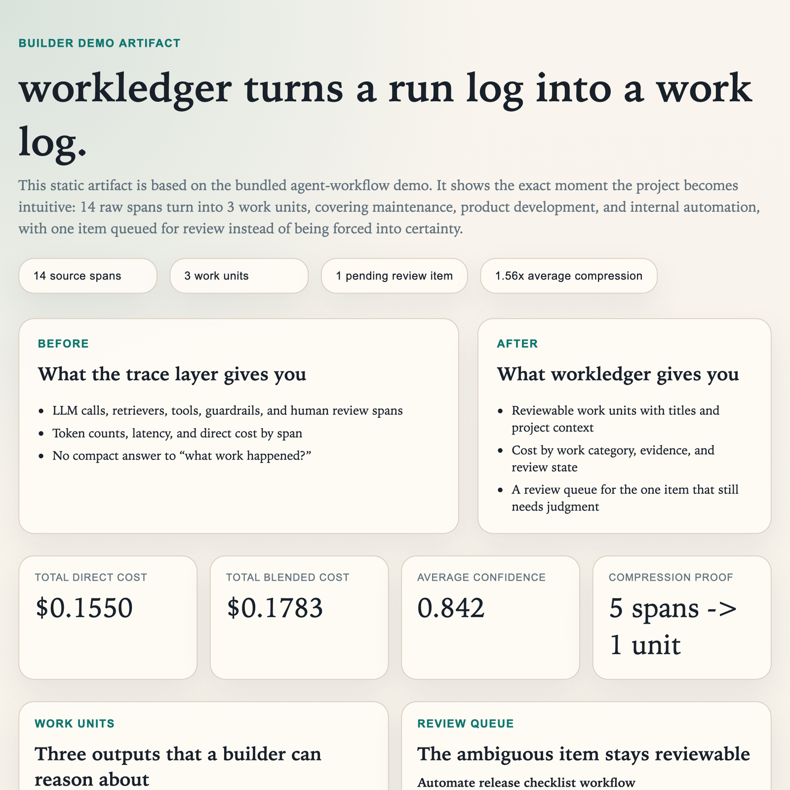
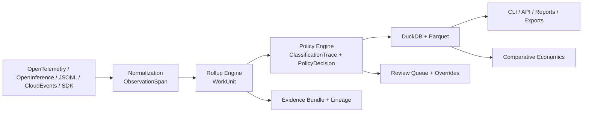

# workledger

[](https://github.com/couscous18/workledger/actions/workflows/ci.yml)
[](https://www.python.org/downloads/)
[](LICENSE)
[](https://couscous18.github.io/workledger/)

`workledger` is an agent work ledger for AI systems.

**Observability tells you what ran. `workledger` tells you what work happened.**

AI traces are great at capturing execution, but teams still need a way to answer higher-level questions:

- What did the agent actually accomplish?
- Which work was expensive, low-trust, or review-worthy?
- Where should we attach policy, accountability, or economics?

`workledger` introduces `WorkUnit` as the missing layer between span-level telemetry and business or governance decisions. Feed in OpenTelemetry, OpenInference, JSONL, or SDK events. Get back reviewable units of work with cost, evidence, policy context, and transparent economics.

## Who This Is For

- Teams running AI agents that produce execution traces (OpenTelemetry, OpenInference, JSONL)
- Engineers who need to answer "what work happened?" not just "what code ran?"
- Finance and governance teams that need policy-backed classification of AI work

## Who This Is Not For

- Generic application analytics or APM replacement
- A tracing backend — workledger consumes traces, it doesn't collect them
- Production-ready systems (this is alpha, expect breaking changes)

```bash
git clone https://github.com/couscous18/workledger.git && cd workledger
uv sync --all-extras
uv run wl demo agent-cost --project-dir .workledger/agent-cost --open-report
uv run wl compare-costs --from-project .workledger/agent-cost
```



[See Proof Artifact](docs/assets/builder-demo-report.html) · [Builder Demo](docs/builder-demo.md) · [Getting Started](docs/getting-started.md) · [Docs](https://couscous18.github.io/workledger/)

## The Missing Primitive

Observability systems tell you about spans, tokens, models, and tools. They do not give you a durable ledger of work that a human can inspect, review, and reason about.

`WorkUnit` is that ledger layer.

```text
raw spans
  -> normalized observations
  -> rolled-up work units
  -> classification traces
  -> review, reporting, and economics
```

That lets builders move from "what executed?" to questions like:

- What did this agent run add up to?
- Which outputs were expensive but still low-trust?
- Which items need human review instead of fake certainty?
- How would this workload look under open-hosted or self-hosted assumptions?

## Why Builders Care

- Many spans become a few understandable `WorkUnit`s
- Cost is attached to work, not just raw requests
- Ambiguity stays visible through a review queue
- Evidence and lineage stay attached to every interpretation
- Economics remain transparent and assumption-driven, not benchmark theater

## Principles

- Compress noise into accountable work
- Preserve uncertainty instead of overstating certainty
- Keep evidence and lineage attached to every interpretation
- Separate observed facts from modeled assumptions
- Stay open, inspectable, and local-first by default

## 60-Second Quickstart

### Install from source

```bash
git clone https://github.com/couscous18/workledger.git
cd workledger
uv sync --all-extras
uv run wl init --project-dir .workledger
uv run wl demo agent-cost --project-dir .workledger/agent-cost --open-report
uv run wl compare-costs --from-project .workledger/agent-cost
```

> PyPI publishing is coming. For now, install from source.

### What You Should See

- many raw spans compressed into a smaller set of `WorkUnit`s
- expensive or low-trust work surfaced in a way humans can inspect
- a pending review queue instead of fake certainty
- an economics comparison that separates observed usage from modeled assumptions
- an HTML report at `.workledger/agent-cost/reports/summary.html`

### Broader Demo Bundle

If you want the multi-team demo set after the flagship agent path:

```bash
uv run wl demo all --project-dir .workledger/demo --open-report
uv run wl compare-costs --from-project .workledger/demo
```

### Bring Your Own Traces (3 Minutes)

Already have OpenTelemetry JSON exports? Try this:

```bash
uv run wl init --project-dir .workledger/my-traces
uv run wl ingest your-traces.json --project-dir .workledger/my-traces
uv run wl rollup --project-dir .workledger/my-traces
uv run wl classify --project-dir .workledger/my-traces
uv run wl report --project-dir .workledger/my-traces
```

Supported formats: `otel`, `openinference`, `jsonl`, `cloudevents`, `sdk`

### Tiny Python Example

```bash
uv run python examples/tiny_pipeline.py
```

## Why This Is a New Layer

- It rolls many spans into a unit you can actually reason about: `WorkUnit`
- It adds explainable, policy-backed interpretation on top of raw traces
- It preserves ambiguity with a review queue when confidence is not high enough
- It compares deployment options with explicit assumptions instead of hiding the math

## What Becomes Possible Once Work Is Ledgered

- agent cost analysis and review burden tracking
- management reporting on AI work by team or function
- software capex review and other policy-backed downstream interpretations
- exports and local analytics that stay grounded in canonical trace data

## Comparative Economics

`wl compare-costs` uses observed token totals from ingested work and compares them against editable scenario presets:

- `proprietary_api`
- `open_hosted`
- `self_hosted_gpu`

These scenarios are not benchmark claims. They are transparent, configurable assumptions layered on top of the canonical trace and work-unit data.

## V1 Includes

- Canonical models for `ObservationSpan`, `WorkUnit`, `ClassificationTrace`, `PolicyDecision`, `EvidenceRef`, `PolicyPack`, and `ReportArtifact`
- Ingestion for JSONL, OpenInference-like payloads, OTEL-like JSON, CloudEvents JSON, and direct SDK-shaped events
- Rollup engine that compresses low-level spans into human-reviewable work units
- Declarative policy pack engine with explainable rule matches and review-required states
- DuckDB-backed local analytical store with export support
- CLI (`wl`) for init, ingest, rollup, classify, report, export, explain, demo, compare-costs, doctor, and policy validation
- Local FastAPI server with OpenAPI docs and optional API-key auth
- Runnable agent, marketing, and support demos, plus a software capex publication bundle as a downstream example
- JSON Schema export and published OpenAPI artifacts
- CSV, JSON, Parquet, Markdown, and HTML report outputs

## Architecture


