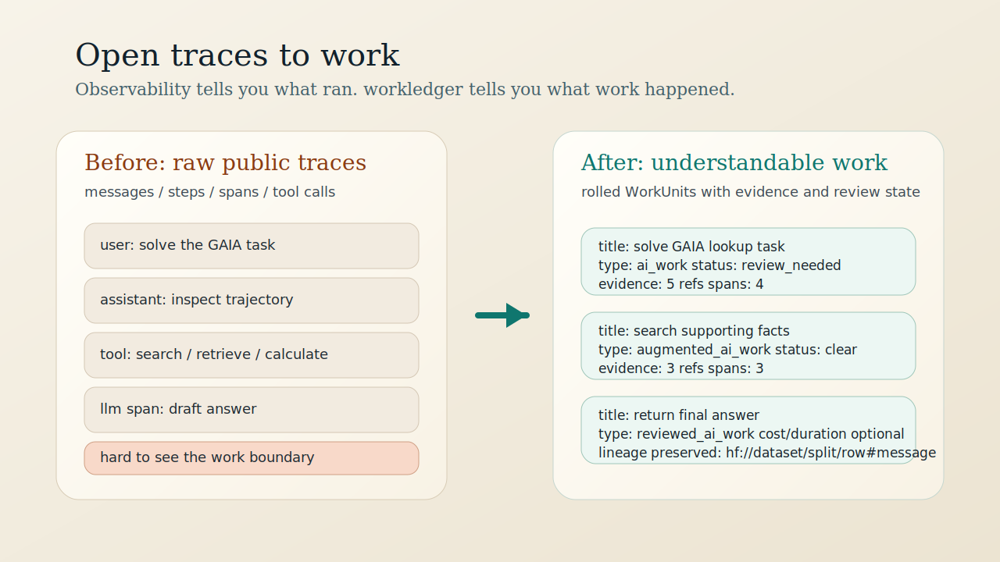

# workledger

[](https://github.com/couscous18/workledger/actions/workflows/ci.yml)
[](https://www.python.org/downloads/)
[](LICENSE)
[](https://couscous18.github.io/workledger/)

`workledger` is the open trace-to-work layer for AI systems.

**Observability tells you what ran. `workledger` tells you what work happened.**

Open-source AI is creating more public traces.
What is missing is an open way to attribute those traces to work.

`workledger` turns raw traces, trajectories, and agent messages into `WorkUnit`s: smaller, reviewable units of work with preserved evidence, lineage, and explicit ambiguity.

It is for builders who already have traces and need the missing layer between execution records and legible work.

```text
raw traces / messages / spans
  -> normalized observations
  -> rolled-up work units
  -> review / classification / economics
```

## Why Now

Public trace datasets are starting to accumulate across the Hugging Face and open-agent ecosystem.

- [`smolagents/gaia-traces`](https://huggingface.co/datasets/smolagents/gaia-traces) gives a compact public messages/trajectory dataset
- [`kshitijthakkar/smoltrace-traces-20260130_053009`](https://huggingface.co/datasets/kshitijthakkar/smoltrace-traces-20260130_053009) gives trace-native `trace_id + spans + totals`
- more public traces are becoming inspectable, comparable, and reproducible

Those traces tell you what executed.
They do not yet give you an open, adapter-friendly way to answer:

- what understandable work happened?
- which traces still need review because the work is ambiguous?
- where should evidence, policy, or economics attach?

## What You Can Run Right Away

```bash
git clone https://github.com/couscous18/workledger.git
cd workledger
uv sync --all-extras

uv run wl demo hf-gaia --project-dir .workledger/hf-gaia --open-report
uv run wl demo hf-smoltrace --project-dir .workledger/hf-smoltrace --open-report

uv run wl ingest-hf smolagents/gaia-traces --adapter gaia --split train --limit 3 --seed 7 --project-dir .workledger/hf-gaia
uv run wl rollup --project-dir .workledger/hf-gaia
uv run wl report --project-dir .workledger/hf-gaia
```

The flagship path is [`smolagents/gaia-traces`](https://huggingface.co/datasets/smolagents/gaia-traces): public agent messages in, understandable `WorkUnit`s out.



[Open Traces](docs/open-traces.md) · [Trace To Work](docs/trace-to-work.md) · [Public Traces Demo](docs/public-traces-demo.md) · [Getting Started](docs/getting-started.md)

## Before / After

Before:

- many raw messages, steps, spans, and tool calls
- plenty of observability detail
- unclear boundaries for the actual work

After:

- a few `WorkUnit`s with title, type, status, review state, evidence count, lineage, and optional downstream cost
- review-required items where the trace does not cleanly resolve
- a stable seam for adapters across public trace formats

## The Missing Primitive

`WorkUnit` is the public primitive in `workledger`.

Tracing backends and observability tools are good at preserving execution detail.
`workledger` sits one layer above them and preserves the part people actually need to reason about: the work.

- `ObservationSpan` is the normalized execution record
- `WorkUnit` is the rolled, human-readable unit of work
- policy, review, and economics are downstream interpretations on top of attributed work

## First-Class Public Datasets

Supported now:

- [`smolagents/gaia-traces`](https://huggingface.co/datasets/smolagents/gaia-traces)
  message / trajectory shape
- [`kshitijthakkar/smoltrace-traces-20260130_053009`](https://huggingface.co/datasets/kshitijthakkar/smoltrace-traces-20260130_053009)
  trace / spans / totals shape

Planned next:

- [`smolagents/codeagent-traces`](https://huggingface.co/datasets/smolagents/codeagent-traces)
  documented as a future adapter target, not yet implemented

## What `workledger` Is

- an open trace-to-work attribution layer
- a bridge from public traces to `WorkUnit`
- a local-first pipeline for normalization, rollup, review, and reporting
- a small adapter seam for new trace ecosystems

## What `workledger` Is Not

- an APM product
- a tracing backend
- a generic eval framework
- a reasoning-trace viewer
- enterprise compliance software with OSS paint on top

## Why Builders Care

- many spans can become a few understandable `WorkUnit`s
- ambiguity stays visible instead of getting flattened into fake certainty
- evidence and lineage stay attached to each interpretation
- public datasets become runnable demos instead of static artifacts
- economics remain available, but as a downstream lens, not the thesis

## CLI Surface

```bash
wl ingest traces.jsonl
wl ingest-hf smolagents/gaia-traces --adapter gaia --split train --limit 3 --seed 7
wl rollup
wl classify
wl report
wl demo hf-gaia
wl demo hf-smoltrace
wl compare-costs --from-project .workledger/hf-smoltrace
```

`wl report` no longer includes economics by default. Add `--include-economics` when you want that downstream view.

## Existing Downstream Paths

Synthetic demos, policy packs, and software capex review are still in the repo.
They are now downstream examples of the same trace-to-work foundation, not the homepage story.

## Development

```bash
make lint
make test
make docs
```

See [CONTRIBUTING.md](CONTRIBUTING.md) for adapter and fixture guidance.
