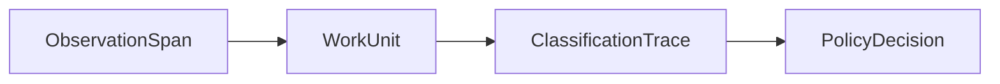

# Data Model

Core objects:

- `ObservationSpan`
- `WorkUnit`
- `ClassificationTrace`
- `PolicyDecision`
- `EvidenceRef`
- `PolicyPack`
- `ReportArtifact`

## ObservationSpan

`ObservationSpan` is the normalized execution record.

Key fields:

- `source_kind`, now including `huggingface`
- `trace_id`, `span_id`, `parent_span_id`
- `span_kind`, `name`, `start_time`, `end_time`
- `token_input`, `token_output`, `direct_cost`
- `attributes` for mapped source fields
- `facets` for namespaced metadata such as `hf.*` or `smoltrace.*`
- `raw_payload_ref` for source lineage such as `hf://dataset/split/row#message-2`

## WorkUnit

`WorkUnit` is the missing primitive.

It groups multiple observations into one understandable unit of work that a human can inspect, review, and attach downstream interpretation to.

Key fields:

- `title`, `summary`, `objective`
- `review_state`, `trust_state`
- `direct_cost`, `allocated_cost`, `total_cost`
- `source_span_ids`, `compression_ratio`
- `evidence_bundle`, `lineage_refs`

## ClassificationTrace

`ClassificationTrace` is a downstream interpretation of one `WorkUnit`.

It is useful, but it is not the core contribution. The trace-to-work attribution happens before this layer.

## Relationship

