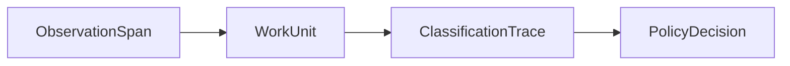

# Data Model

Core objects:

- `ObservationSpan`
- `WorkUnit`
- `ClassificationTrace`
- `PolicyDecision`
- `EvidenceRef`
- `PolicyPack`
- `ReportArtifact`

`WorkUnit` is the key public abstraction. It bridges raw telemetry to review, policy, reporting, and economics.

## ObservationSpan

`ObservationSpan` is the normalized event record.

Key fields:

- `source_kind`, `trace_id`, `span_id`, `parent_span_id`
- `span_kind`, `name`, `start_time`, `end_time`
- `model_name`, `provider`, `tool_name`
- `token_input`, `token_output`, `direct_cost`
- `attributes` for source metadata
- `facets` for namespaced extension data

`token_input` and `token_output` are the main usage counters used for downstream cost analysis and comparative economics.

## WorkUnit

`WorkUnit` is the rollup layer and the missing primitive in the system. It groups multiple spans into a unit of work that a human can reason about, review, and attach policy to.

Key fields:

- `title`, `summary`, `objective`
- `actor`, `actor_kind`, `project`, `team`
- `review_state`, `trust_state`
- `direct_cost`, `allocated_cost`, `total_cost`
- `source_span_ids`, `compression_ratio`
- `evidence_bundle`, `lineage_refs`

## ClassificationTrace

`ClassificationTrace` records policy-backed interpretation of one work unit.

Key fields:

- `work_category`
- `policy_outcome`
- `confidence_score`
- `explanation`
- `reviewer_required`
- `decisions`

## Relationships

## Extension Facets

Extension facets should use namespaced keys such as:

- `git.*`
- `marketing.*`
- `support.*`
- `finance.*`
- `vendor.*`
