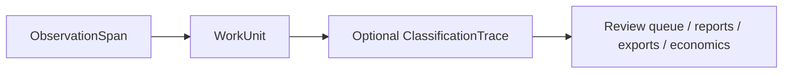

# Data Model

The implemented model layer revolves around these core objects:

- `ObservationSpan`
- `WorkUnit`
- `ClassificationTrace`
- `PolicyDecision`
- `EvidenceRef`
- `PolicyPack`
- `ReportArtifact`

## ObservationSpan

`ObservationSpan` is the normalized ingestion record. Every supported input path maps into this object before anything else happens.

Key fields:

- `source_kind`
- `trace_id`, `span_id`, `parent_span_id`
- `span_kind`, `name`, `start_time`, `end_time`
- `token_input`, `token_output`, `direct_cost`
- `token_taxes` for optional token-tax metadata
- `attributes` for mapped source fields
- `facets` for namespaced metadata such as `hf`, `smoltrace`, `git`, `marketing`, or `support`
- `raw_payload_ref` for source lineage such as `hf://dataset/split/row#message-2`
- `work_unit_key` for sources that already expose a useful rollup boundary

## WorkUnit

`WorkUnit` is the main primitive in this repository. It groups one or more observations into a unit a person can inspect, review, and reason about.

Key fields:

- `title`, `summary`, `objective`
- `actor`, `actor_kind`, `project`, `team`, `cost_center`
- `review_state`, `trust_state`
- `direct_cost`, `allocated_cost`, `total_cost`
- `source_span_ids`, `compression_ratio`
- `evidence_bundle`, `lineage_refs`
- `labels`, `facets`, `source_systems`

This is where raw execution detail becomes accountable work.

## ClassificationTrace

`ClassificationTrace` is a downstream interpretation of one `WorkUnit`. It exists only after `wl classify` runs.

Key fields:

- `policy_basis`, `work_category`, `policy_outcome`
- `cost_category`, `direct_cost`, `indirect_cost`, `blended_cost`
- `confidence_score`, `evidence_score`, `evidence_strength`
- `reviewer_required`, `reviewer_status`, `override_status`
- `decisions` for explainable policy outcomes

## Supporting Objects

- `PolicyDecision`: one rule match or default policy decision
- `EvidenceRef`: evidence stored inside a `WorkUnit`
- `PolicyPack`: YAML-loaded ruleset for `wl classify`
- `PolicyRun`: summary row for one classification run
- `ReportArtifact`: persisted reference to a generated report file

## Relationship

