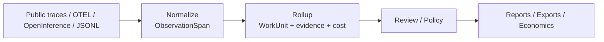

# How It Works

`workledger` sits between raw traces and higher-level reasoning about work.

1. Ingest raw traces, messages, or span trees.
2. Normalize them into `ObservationSpan` records that preserve source lineage, token usage, and direct cost.
3. Roll related observations into `WorkUnit`s with evidence bundles, lineage refs, and work-level cost.
4. Keep ambiguity visible through review and trust states instead of flattening everything into fake certainty.
5. Layer review queues, policy interpretation, reporting, and economics on top only after the work has been attributed.

The key transition happens at rollup:
raw execution detail becomes ledgered work that people can inspect, review, and attribute.
