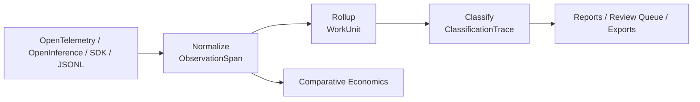

# How It Works

`workledger` sits one layer above observability and adds the ledger layer that trace systems do not provide on their own.

1. Ingest raw traces.
2. Normalize them into `ObservationSpan` records.
3. Roll related spans into `WorkUnit` objects that humans can inspect.
4. Classify those work units with policy packs and preserve ambiguity when review is required.
5. Render reports and economics comparisons from the normalized store.
