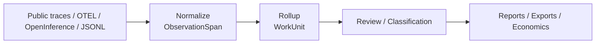

# How It Works

`workledger` sits between raw traces and higher-level reasoning about work.

1. Ingest raw traces, messages, or span trees.
2. Normalize them into `ObservationSpan` records.
3. Roll related observations into `WorkUnit`s.
4. Keep ambiguity visible through review states and preserved evidence.
5. Layer policy or economics on top only after the work has been attributed.
