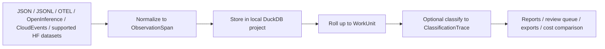

# How It Works

`workledger` sits between raw trace inputs and higher-level reasoning about work.

## The Actual Pipeline

1. `wl init` creates a local project directory, copies built-in policy packs, and exports the schema bundle.
2. `wl ingest` or `wl ingest-hf` normalizes input payloads into `ObservationSpan`.
3. Those spans are stored in a local DuckDB database.
4. `wl rollup` groups related spans into `WorkUnit` records using `work_unit_key`, common issue/task identifiers, or trace ID fallback.
5. `wl classify` optionally applies a YAML policy pack to each `WorkUnit` and writes `ClassificationTrace` plus underlying `PolicyDecision` records.
6. `wl report`, `wl review-queue`, `wl export`, `wl compare-costs`, and `wl benchmark` read from that local store.

## What Rollup Actually Adds

Rollup is the step where the repository becomes more than a trace normalizer. A `WorkUnit` carries:

- title, summary, and objective
- rolled direct and allocated cost
- evidence bundle and lineage refs
- review and trust state
- source span IDs and compression ratio

That is the main primitive in this codebase.

## What Is Optional

- Policy classification is optional. The Hugging Face demos do not run it automatically.
- Comparative economics is optional. `wl report` only includes it when you pass `--include-economics`.
- The FastAPI server is a wrapper around the same local pipeline, not a separate execution path.
