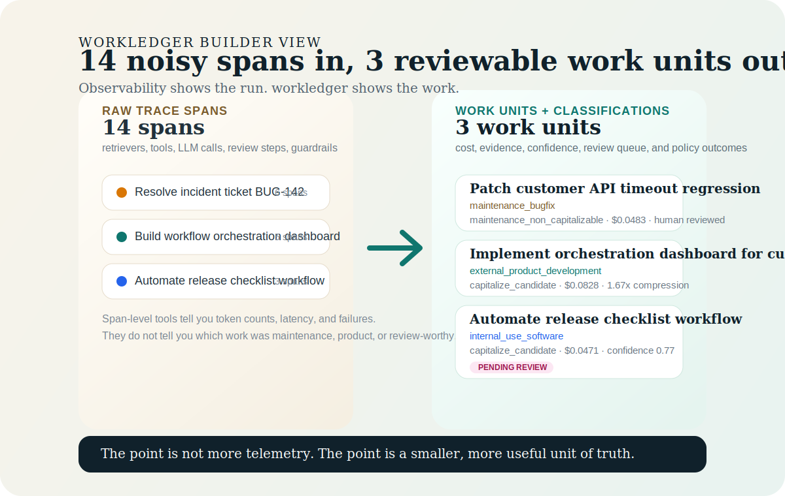

# workledger

`workledger` is an agent work ledger for AI systems.

**Observability tells you what ran. `workledger` tells you what work happened.**



`workledger` introduces `WorkUnit` as the missing layer between span-level telemetry and the decisions teams actually need to make. It compresses raw traces into accountable units of work with evidence, review states, and transparent economics.

If you only try one thing, run:

```bash
pip install workledger
wl demo agent-cost --project-dir .workledger/agent-cost --open-report
wl compare-costs --from-project .workledger/agent-cost
```

Use it when you already have traces and want:

- business-level work units instead of span soup
- evidence-backed cost rollups
- explainable work classifications and policy outcomes
- review queues for ambiguous work instead of fake certainty
- side-by-side economics estimates for proprietary, open-hosted, and self-hosted assumptions

Principles:

- compress noise into accountable work
- preserve uncertainty instead of overstating certainty
- keep evidence and lineage attached to interpretation
- separate observed facts from modeled assumptions
- stay open, inspectable, and local-first

Start here:

- [Proof Artifact](assets/builder-demo-report.html)
- [Builder Demo](builder-demo.md)
- [Getting Started](getting-started.md)
- [How It Works](how-it-works.md)
- [Comparative Economics](comparative-economics.md)
- [Software CapEx Review](software-capex.md)
